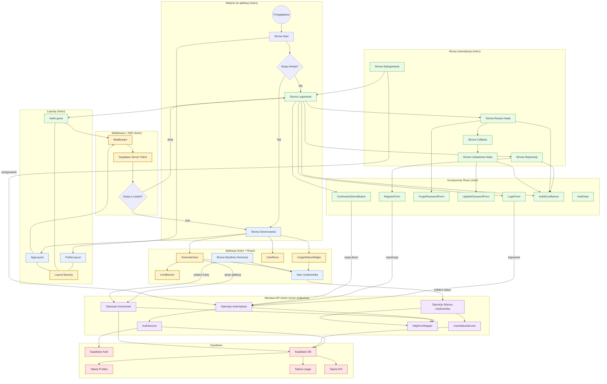

<architecture_analysis>

## 1) Komponenty wymienione w dokumentacji (PRD + auth-spec)

Poniżej lista elementów UI/architektury, które wprost wynikają z `.ai/prd.md` oraz `.ai/auth-spec.md`.

### Elementy wynikające z PRD (w kontekście autentykacji)

- System kont użytkowników: **tryb demo vs pełne konto** (US-001)
- Bezpieczne logowanie oraz “dwuskładnikowa walidacja” (US-001)
- Widoczny status konta (demo/full) i limity w interfejsie (US-001, US-007)
- Backendowe egzekwowanie limitów zależnych od roli (US-001, US-007)
- Rejestrowanie KPI dla sesji/logowania (US-001, US-009)

### Strony Astro (z auth-spec)

- `src/pages/login.astro`
- `src/pages/register.astro`
- `src/pages/forgot-password.astro`
- `src/pages/update-password.astro`
- `src/pages/auth/callback.(astro|ts)` (jako punkt powrotu po weryfikacji maila / recovery)
- `src/pages/logout.astro` (opcjonalnie)
- `src/pages/index.astro` (start) oraz wejście do aplikacji (redirect wg sesji)

### Layouty Astro (z auth-spec)

- `src/layouts/PublicLayout.astro` (opcjonalny alias istniejącego layoutu)
- `src/layouts/AuthLayout.astro` (ekrany logowania/rejestracji/resetu)
- `src/layouts/AppLayout.astro` (shell aplikacji dla tras “po zalogowaniu”, z badge i limitami)

### Komponenty React (z auth-spec)

- `LoginForm`
- `RegisterForm`
- `ForgotPasswordForm`
- `UpdatePasswordForm`
- `ContinueAsDemoButton`
- `AuthErrorBanner`
- `AuthGate` (opcjonalnie, wsparcie UX po stronie klienta)
- `UserMenu` (wylogowanie)
- `UsageStatusWidget` (status demo/full + limity; wykorzystywany w App Shell)

### Moduły backendowe / serwisy (z auth-spec)

- Middleware Astro: rozszerzenie `src/middleware/index.ts` o weryfikację sesji i przygotowanie kontekstu
- Warstwa usług:
  - `auth.service.ts` (login/register/logout/demo/callback)
  - `user-status.service.ts` (budowa `UserStatusDto`)
  - `http-error.ts` (mapowanie błędów na kody)
- Integracja SSR z Supabase przez `@supabase/ssr` (cookie `getAll/setAll`)

### Kontrakty API (z auth-spec; bez nazywania endpointów w węzłach diagramu)

- Operacje: login, rejestracja, utworzenie sesji demo, wylogowanie, status użytkownika (role + limity)

## 2) Elementy znalezione w codebase (obecny stan repo)

### Istniejące strony Astro

- `src/pages/index.astro` (Welcome)
- `src/pages/generate.astro` (osadza React `GenerateView`)
- `src/pages/generate/results.astro`

### Istniejące layouty i middleware

- `src/layouts/Layout.astro` (minimalny layout – będzie bazą do rozbudowy)
- `src/middleware/index.ts` (obecnie tylko wstrzykuje `locals.supabase`)

### Istniejące komponenty React (istotne dla flow po auth)

- `src/components/generate/GenerateView.tsx`
- `src/components/generate/LimitBanner.tsx` (istotny dla limitów i komunikatów)

### Istniejące API (dzisiaj na skrócie `DEFAULT_USER_ID`)

- Generowanie: `src/pages/api/ai/generate.ts` oraz alias `src/pages/api/generate.ts`
- Decki: `src/pages/api/decks.ts`
- Karty: `src/pages/api/cards/[card_id].ts`
- Karty dla źródła: `src/pages/api/sources/[source_id]/cards.ts`
- Dev helpery: `src/pages/api/dev/default-user.ts`, `src/pages/api/dev/reset-usage.ts`

### Baza danych i auth w Supabase

- `public.profiles` z `account_role` = `demo|full` + trigger tworzący profil po `auth.users`
- RLS dla `anon` i `authenticated`
- `user_usage_stats` (limity dzienne generacji)
- `kpi_events` (zdarzenia)

## 3) Główne strony i odpowiadające komponenty

- `/` (Start, Astro): decyzja “zalogowany?” i redirect
- Strony auth (Astro): renderują formularze React i pokazują błędy
- Strony aplikacji (Astro + React islands): `GenerateView` i kolejne widoki wymagają:
  - odczytu statusu (demo/full + limity)
  - spójnej obsługi 401/limitów

## 4) Przepływ danych (high-level)

- Przeglądarka → Strony Astro (SSR) → Layouty (shell) → Komponenty React (formularze i interakcje)
- React → Warstwa API (operacje auth/status oraz istniejące API domenowe) → Supabase (Auth + DB)
- Middleware Astro jest “bramą” do sesji i wnosi kontekst użytkownika dla SSR i API

## 5) Krótki opis funkcjonalności komponentów (najważniejsze)

- `LoginForm`: logowanie pełnego konta; obsługa błędów i redirect `returnTo`
- `RegisterForm`: rejestracja; obsługa potwierdzenia email (token) jako “drugi krok” weryfikacji
- `ContinueAsDemoButton`: szybkie utworzenie anon sesji demo
- `ForgotPasswordForm` + `UpdatePasswordForm`: odzyskanie hasła w oparciu o redirect/callback
- `AppLayout` + `UsageStatusWidget`: stały widok roli i limitów (US-001/US-007)
- `LimitBanner`: komunikaty o limitach (np. brak generacji) i spójny UX błędów
- Middleware: weryfikacja sesji i przygotowanie `locals` dla SSR/API
  </architecture_analysis>

<mermaid_diagram>

</mermaid_diagram>
